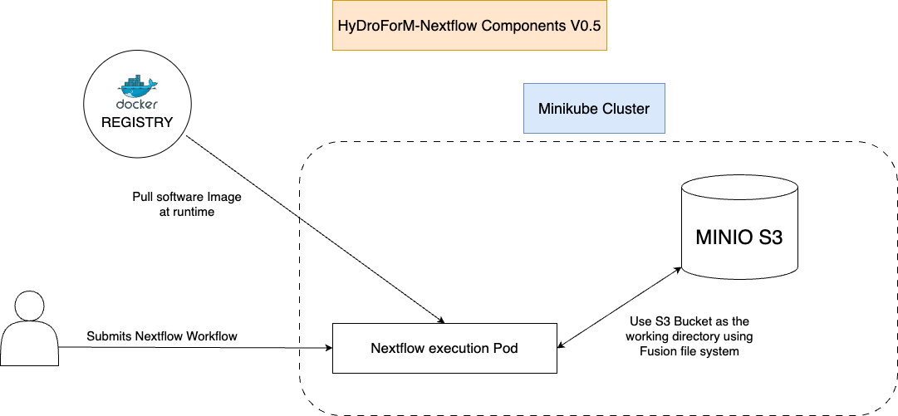

# HyDroForM Nextflow

[](https://www.nextflow.io/)
[](https://www.docker.com/)
[](https://minikube.sigs.k8s.io/docs/)
[](https://kubernetes.io/)
[](https://www.python.org/)
[](https://www.java.com/)

This repository aims to translate our existing HyDroForM CWL workflows to Nextflow.

## Table of Contents

- [HyDroForM Nextflow](#hydroform-nextflow)
  - [Table of Contents](#table-of-contents)
  - [Experimental Architecture](#experimental-architecture)
  - [Installation of the Environment](#installation-of-the-environment)
    - [Hardware Setup](#hardware-setup)
    - [Software Setup](#software-setup)
      - [Install Docker Engine](#install-docker-engine)
      - [Nvidia Container Toolkit](#nvidia-container-toolkit)
      - [Install Minikube](#install-minikube)
      - [Install Nextflow](#install-nextflow)
    - [Automated Installation](#automated-installation)
      - [Coupling Minikube cluster with Nextflow](#coupling-minikube-cluster-with-nextflow)
      - [Running a sample workflow](#running-a-sample-workflow)

## Experimental Architecture

Current version: V0.5

Basic initial deployment of the Nextflow environment with Minikube and Minio.



### Components

- **Minikube**: A single-node Kubernetes cluster that can be run locally.
- **Minio**: An object storage server compatible with Amazon S3.
- **Nextflow**: A workflow manager that enables the development of complex data pipelines.
- **Docker**: A platform for developing, shipping, and running applications.

## Installation of the Environment

### Hardware Setup

Our reference testing Virtual Machines:

- Ubuntu 22.04.5 LTS
- 8 CPUs,
- 32 GB RAM
- Nvidia A100 GPU

Without a GPU you can run this setup and simple workflows on Minikube with little resources.
However, the automated install supports Nvidia GPUs and the Nvidia Container Toolkit.

Tested on Digital Ocean Droplet with:

- Ubuntu 22.04.5 LTS
- 2 CPUs,
- 4 GB RAM
- No GPU

### Software Setup

This section describes step by step how to install all of the required software on a blank VM.

To deploy a Minikube cluster with NextFlow and Minio take a look at [Automated Installation](#automated-installation)

#### Install Docker Engine

See the docs for more details: [Docker](https://docs.docker.com/engine/install/ubuntu/)

Setting up the repository:

```zsh
sudo apt-get update
sudo apt-get install ca-certificates curl
sudo install -m 0755 -d /etc/apt/keyrings
sudo curl -fsSL https://download.docker.com/linux/ubuntu/gpg -o /etc/apt/keyrings/docker.asc
sudo chmod a+r /etc/apt/keyrings/docker.asc

echo \
  "deb [arch=$(dpkg --print-architecture) signed-by=/etc/apt/keyrings/docker.asc] https://download.docker.com/linux/ubuntu \
  $(. /etc/os-release && echo "$VERSION_CODENAME") stable" | \
  sudo tee /etc/apt/sources.list.d/docker.list > /dev/null
sudo apt-get update

 sudo apt-get install docker-ce docker-ce-cli containerd.io docker-buildx-plugin docker-compose-plugin
```

Or using an automated install of Docker Engine:

```zsh
curl -fsSL https://get.docker.com | sh
```

Following the Linux post-installation steps:

```zsh
sudo usermod -aG docker ${USER}
```

Log out and log back in so that your group membership is re-evaluated.

Or
  
```zsh
newgrp docker
```

Test the installation with:

```zsh
docker run hello-world
```

#### Nvidia Container Toolkit

If you are planning to use GPUs and run Docker containers, you will need to install the Nvidia Container Toolkit:

[Nvidia Container Toolkit](https://docs.nvidia.com/datacenter/cloud-native/container-toolkit/latest/install-guide.html)

```zsh
curl -fsSL https://nvidia.github.io/libnvidia-container/gpgkey | sudo gpg --dearmor -o /usr/share/keyrings/nvidia-container-toolkit-keyring.gpg \
  && curl -s -L https://nvidia.github.io/libnvidia-container/stable/deb/nvidia-container-toolkit.list | \
    sed 's#deb https://#deb [signed-by=/usr/share/keyrings/nvidia-container-toolkit-keyring.gpg] https://#g' | \
    sudo tee /etc/apt/sources.list.d/nvidia-container-toolkit.list
```

```zsh
sudo apt-get update
```

```zsh
sudo apt-get install -y nvidia-container-toolkit
```

#### Install Minikube

Start by installing kubectl:

```zsh
mkdir -p $HOME/.local/bin \
&& curl -fsSLo $HOME/.local/bin/kubectl "https://dl.k8s.io/release/$(curl -L -s https://dl.k8s.io/release/stable.txt)/bin/linux/amd64/kubectl" \
&& chmod +x $HOME/.local/bin/kubectl
```

Then install Minikube:

```zsh
mkdir -p $HOME/.local/bin \
&& curl -fsSLo $HOME/.local/bin/minikube "https://storage.googleapis.com/minikube/releases/latest/minikube-linux-amd64" \
&& chmod +x $HOME/.local/bin/minikube
```

#### Install Nextflow

Nextflow requires `Bash 3.2` or later as well as `Java 17 up to 23`

The suggested way to install Java is to use `SDKMAN`:

```zsh
curl -s "https://get.sdkman.io" | bash
```
  
  Then install Java:
  
  ```zsh
  sdk install java 17.0.10-tem
  ```

Nextflow can be installed with the following command:

```zsh
curl -s https://get.nextflow.io | bash
chmod +x nextflow # make it executable
mkdir -p $HOME/.local/bin/ # create the bin directory
mv nextflow $HOME/.local/bin/ # move the executable to the bin directory
```

Make sure to include the directory in your PATH:

```zsh
echo 'export PATH=$HOME/.local/bin:$PATH' >> $HOME/.bashrc
source $HOME/.bashrc
```

or for `zsh` afficionados:

```zsh
echo 'export PATH=$HOME/.local/bin:$PATH' >> $HOME/.zshrc
source $HOME/.zshrc
```

### Automated Installation

You can use the provided script to automate the installation process:

```zsh
sudo ./scripts/install.sh
```

It basically runs all of the commands mentioned above in the correct order and setup.

Then you can use `setup_minikube.sh` to set up a Minikube cluster with the correct configuration.

```zsh
./scripts/setup_minikube.sh
```

To utilize the `Fusion` file system we will deploy `Minio` to our cluster for testing purposes.
Nextflow support CEPH, AWS, Azure, Google Cloud... so you can plug in whatever file system you are using.

This will create a Minio instance in your cluster.
**NOTE**: Remember to customize the `setup_minio.yaml` file to your needs, especially the access keys
and the node port.

```zsh
kubectl apply -f ./scripts/setup_minio.yaml
```

Check if the service is running:

```zsh
kubectl get pods -n minio
```

The `Minio Client` is also useful and can be installed with:

```zsh
curl -O https://dl.min.io/client/mc/release/linux-amd64/mc
chmod +x mc
sudo mv mc /usr/local/bin/
```

To make our life easier we can alias our minio address:

```zsh
mc alias set myminio http://<MINIKUBE_IP>:30000 <ACCESS_KEY> <SECRET_KEY>
```

Now you can use the `mc` command to interact with your Minio instance.

We can create a sample bucket for our workflows:

```zsh
mc mb myminio/nextflow-bucket
```

To check if the bucket was created:

```zsh
mc ls myminio
```

#### Coupling Minikube cluster with Nextflow

Since we are using the `Fusion` file system we need to set up a few things in the `nextflow.config` file.

A sample is provided in the root but basically you need to set the following:

```zsh
fusion {
    enabled = true # enable fusion
    exportStorageCredentials = true # export the credentials to the environment
}
```

Then an `aws` section is required. It may look something like this:

```zsh
aws {
  accessKey = '' // Minio access key
  secretKey = '' // Minio secret key
  profile = '~/.aws/credentials' // Minio profile if aws cli is installed
  client {
     s3PathStyleAccess = true // Allows you to use the S3:// endpoint format
     endpoint = "http://XXX.XXX.XX.X:30000/" //minikube ip + minio service port
     protocol = 'http'
  }
}
```

#### Running a sample workflow

There are two ways to run the workflow using `nextflow`

##### Running the workflow locally

If you `cd` to the workflow directory you leave out the `nextflow.config` which means all our cluster setup is ignored.
This allows you to run the workflow locally.

To run a hello world like workflow:

```zsh
cd src/hello_world/
nextflow run test-workflow.nf
```

This executes the command locally and returns the output files in the `work` directory.

##### Running the workflow on a cluster

To run the workflow on a cluster you need to specify the `nextflow.config` file.
This means you either run the `nextflow` command from the root directory or specify the path to the `nextflow.config` file.

From root:

```zsh
nextflow run ./src/hello_world/test-workflow.nf -work-dir s3://nextflow-bucket/scratch
```

From anywhere else:
  
```zsh
nextflow run <path_to_workflow.nf> -work-dir s3://nextflow-bucket/scratch -c <path_to_nextflow.config>
```

### To do

- [ ] Deploy the infrastructure to our bigger VM with a GPU
- [ ] Explore Nextflow integration with GPUs
- [ ] Prepare sample HyDroForM workflows CPU and GPU
- [ ] Test the workflows on the Minikube cluster
- [ ] Add logging and monitoring
